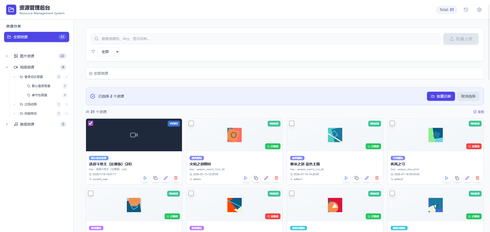
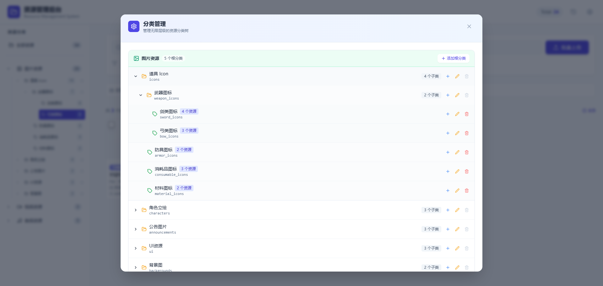
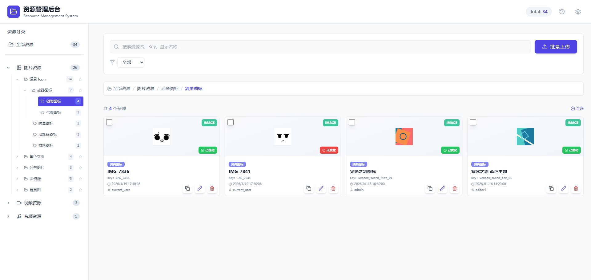
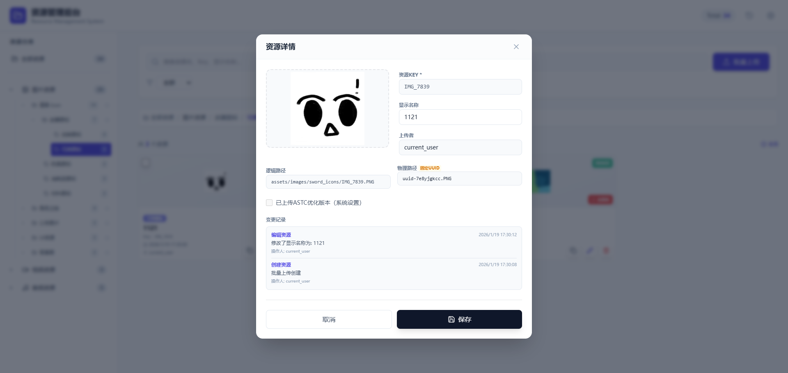
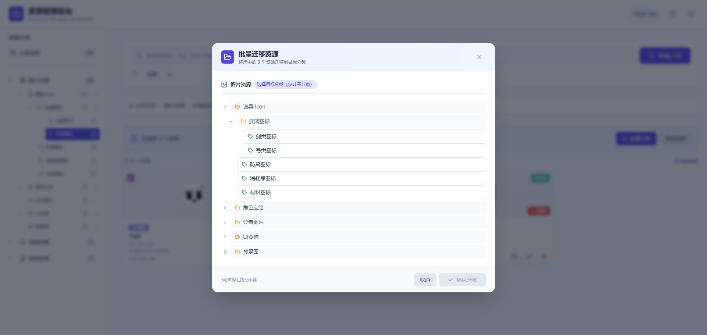
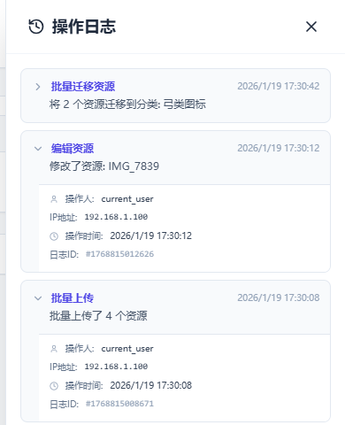
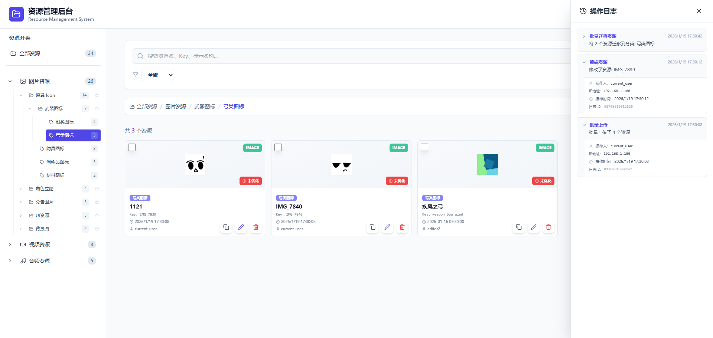

# 资源管理后台-后台设计文档

## 0. 文件信息
> **建议文件名**：`资源管理后台-后台设计文档.md`

---

## [示例后台](https://kamacheng.github.io/source-manager/)

- 后台入口：游戏管理 → 活动配置 → 资源管理

## 1. 资源管理页

### 1.1 页面入口

| 项目     | 说明                           |
| -------- | ------------------------------ |
| 入口位置 | 游戏管理 → 活动配置 → 资源管理 |

### 1.2 筛选条件

| 筛选项名称 | 输入类型   | 默认值 | 业务规则                                                                                         |
| ---------- | ---------- | ------ | ------------------------------------------------------------------------------------------------ |
| 搜索关键词 | 文本输入框 | 空     | 可选，可填入sourceKey和显示名称模糊搜索 根据输入内容筛选列表 在玩家按下enter键后搜索数据库 |
| 资源类型   | 单选下拉框 | 全部   | 可选，支持按图片、视频、音频筛选                                                                 |
| 资源分类   | 树形下拉框 | 全部   | 可选，支持按多级分类筛选，不包含弃用资源                                                         |
| 优化状态   | 单选下拉框 | 全部   | 可选，支持按已优化、未优化筛选                                                                   |

**筛选项枚举值**：

| 筛选项   | 可选值                          |
| -------- | ------------------------------- |
| 资源类型 | 1. 全部 2. 图片 3. 视频 4. 音频 |
| 优化状态 | 1. 全部 2. 已优化 3. 未优化     |

### 1.3 列表展示

**展示方式**：卡片式网格布局，支持批量选择和预览

**资源卡片字段**：

| 序号  | 字段名称   | 字段说明            | 交互行为                      |
| --- | ------ | --------------- | ------------------------- |
| 1   | 选择框    | 用于批量操作          | 点击选中/取消选中资源               |
| 2   | 资源预览   | 图片/视频/音频缩略图     | 点击放大预览                    |
| 3   | 媒体类型标签 | 图片/视频/音频        | 右上角显示媒体类型标签               |
| 4   | 资源key  | 资源的唯一标识符        | 显示前缀"Key: "，支持搜索高亮        |
| 5   | 显示名称   | 资源的展示名称（后台备注文本） | 支持搜索高亮                    |
| 6   | 最后变动时间 | 资源最后变动的时间       | 无                         |
| 7   | 最后操作人员 | 最后操作资源的用户       | 无                         |
| 8   | 分类标签   | 资源所属分类          | 显示分类名称                    |
| 9   | 优化状态   | 是否已上传ASTC优化版本   | 右下角显示"已优化"/"未优化"标签（仅图片资源） |
| 10  | 操作     | 资源的操作按钮组        | 包含预览、复制、编辑、弃用按钮           |

**排序规则**：
- 按照「最后变动时间」来排序
- 搜索时精确匹配优先排序

**空状态**：无资源时显示空白状态提示

**批量操作工具栏**：选中资源时显示，包含已选择资源数量、批量迁移、取消选择按钮

### 1.4 页面操作

**简单操作**：

| 按钮名称 | 位置    | 显示条件 | 点击行为                |
| ---- | ----- | ---- | ------------------- |
| 上传资源 | 列表区上方 | 仅「后台上传资源」标签页 | 打开批量上传弹窗（选中叶子分类）    |
| 路径过滤 | 列表区上方 | 仅「客户端内置资源」标签页 | 打开路径过滤关键词设置弹窗       |
| 读取本地资源 | 列表区上方 | 仅「客户端内置资源」标签页 | 打开文件夹选择对话框，读取客户端本地资源文件信息    |
| 批量迁移 | 列表区上方 | 始终显示 | 打开批量迁移弹窗（需至少选择一个资源） |
| 分类管理 | 右上角   | 始终显示 | 打开分类管理弹窗            |
| 操作日志 | 右上角   | 始终显示 | 打开操作日志信息            |

**详细操作**：

1. 事件【点击"编辑"按钮】
   - 前置判断：无
   - 执行过程：
     - 步骤1：打开【资源编辑弹窗】，显示当前资源信息
     - 步骤2：可修改`显示名称`
     - 步骤3：点击【保存】，提交修改
   - 结果反馈：
     - ✅ 成功：提示"资源修改成功"，关闭弹窗并刷新当前页
     - ❌ 失败：提示具体错误原因

2. 事件【点击"复制"按钮】
   - 前置判断：无
   - 结果反馈：
     - 右下角气泡"已复制：`选中资源的sourceKey`"

3. 事件【点击"预览"按钮】
   - 前置判断：无
   - 执行过程：
     - 步骤1：请求远端资源数据
     - 步骤2：资源加载完成后可进行预览（播放视频、音频、显示图片）
   - 结果反馈：
     - ❌ 失败：提示具体错误原因

4. 事件【点击"弃用"按钮】
   - 前置判断：无
   - 执行过程：
     - 步骤1：弹出确认提示框"确定要将该资源标记为弃用吗？弃用后资源将被移至'弃用资源'区，无法被后台其他地方新引用"
     - 步骤2：点击【确定】，提交标记为弃用请求
     - 步骤3：系统将资源状态修改为弃用，资源移至"弃用资源"放置区
   - 结果反馈：
     - ✅ 成功：提示"资源已标记为弃用"，关闭提示框并刷新当前页
     - ❌ 失败：提示具体错误原因
     - 注：已引用的资源引用关系保持不变，但新的引用会被拒绝。标记为弃用的资源仍保留在系统中，但会移至"弃用资源"放置区，不在正常路径中显示

5. 事件【点击"批量迁移"按钮】
   - 前置判断：是否至少选择了一个资源
     - ❌ 若未选择：提示"请至少选择一个资源"
     - ✅ 若已选择：打开【批量迁移弹窗】
   - 执行过程：
     - 步骤1：选择目标分类
     - 步骤2：显示影响确认（资源数量、目标路径）
     - 步骤3：点击【确认迁移】，提交批量迁移请求
   - 结果反馈：
     - ✅ 成功：提示"资源批量迁移成功"，关闭弹窗并刷新当前页
     - ❌ 失败：提示具体错误原因，撤销全部改动

6. 事件【点击"快速跳转"按钮】（工具栏图标）
   - 前置判断：无
   - 执行过程：
     - 步骤1：点击位于工具栏右侧的【快速跳转】按钮，打开快速跳转弹窗
     - 步骤2：在弹窗中输入资源Key（全匹配），系统会搜索并显示匹配的资源列表
     - 步骤3：点击列表中的资源，系统会自动：
       - 设置正确的资源类型和分类筛选条件
       - 展开分类树到目标资源的位置
       - 对于弃用资源：自动切换到"弃用资源"显示区
       - 对于正常资源：自动切换到对应的分类显示区
   - 结果反馈：
     - ✅ 成功：关闭弹窗，页面已定位到目标资源，显示提示"已定位到资源: [resourceKey]"
     - ⓘ 搜索结果：若找到多个匹配资源（如前缀匹配），显示列表供选择

---

## 2. 分类管理弹窗

### 2.1 页面入口

| 项目     | 说明                            |
| -------- | ------------------------------- |
| 入口位置 | 资源管理页 → 右上角分类管理按钮 |

**页面截图**：

### 2.2 弹窗内容

**整体布局**：
- 按资源类型（图片、视频、音频）分栏展示分类树
- 每个类型栏包含类型标题、根分类数量和新增根分类按钮
- 分类树支持无限层级展开/收起

**页面截图（叶子节点）**：

**分类树展示字段**：

| 序号  | 字段名称  | 字段说明       | 交互行为                                   |
| --- | ----- | ---------- | -------------------------------------- |
| 1   | 展开/收起 | 展开或收起子分类   | 点击展开/收起树形结构                            |
| 2   | 分类图标  | 区分文件夹和叶子节点 | 文件夹：文件夹图标；叶子节点：标签图标 叶子节点：节点下没有其他子节点 |
| 3   | 分类名称  | 分类的显示名称    | 无                                      |
| 4   | 资源数量  | 分类下的资源数量   | 显示在分类名称右侧                              |
| 5   | 操作    | 分类的操作按钮组   | 包含新增子分类、编辑、删除按钮                        |

### 2.3 页面操作

**简单操作**：

| 按钮名称   | 位置       | 点击行为           |
| ---------- | ---------- | ------------------ |
| 新增根分类 | 类型栏右侧 | 打开新增根分类表单 |

**详细操作**：

1. 事件【点击"新增子分类"按钮】
   - 前置判断：检查当前分类下是否有资源
     - ❌ 若有资源：提示"该分类下有资源，请先迁移资源后再添加子分类"
     - ✅ 若无资源：显示新增子分类表单
   - 执行过程：
     - 步骤1：输入子分类名称和文件夹名称
     - 步骤2：点击【添加】，提交新增请求
   - 结果反馈：
     - ✅ 成功：提示"子分类添加成功"，更新分类树
     - ❌ 失败：提示具体错误原因（如分类名重复）

2. 事件【点击"编辑"按钮】
   - 前置判断：无
   - 执行过程：
     - 步骤1：切换到分类编辑模式
     - 步骤2：修改分类名称或文件夹名称
     - 步骤3：点击【保存】，提交修改
   - 结果反馈：
     - ✅ 成功：提示"分类修改成功"，更新分类树
     - ❌ 失败：提示具体错误原因（如分类名重复）

3. 事件【点击"删除"按钮】
   - 前置判断：检查分类下是否有子分类或资源
     - ❌ 若有子分类：提示"无法删除，该分类下仍有子分类"
     - ❌ 若有资源：提示"无法删除，该分类下仍有资源，请先迁移"
     - ✅ 若为空：弹出确认提示框"确定要删除该分类吗？"
   - 执行过程：
     - 步骤1：点击【确定】，提交删除请求
   - 结果反馈：
     - ✅ 成功：提示"分类删除成功"，更新分类树
     - ❌ 失败：提示具体错误原因

**快捷操作**：
- 按 Enter 键：保存当前编辑
- 按 Esc 键：取消当前编辑

---

## 2.4 弃用资源放置区

### 2.4.1 页面入口

| 项目     | 说明                                    |
| -------- | --------------------------------------- |
| 入口位置 | 分类管理弹窗 → 弃用资源特殊放置区（分类树底部） |

### 2.4.2 区域说明

**区域结构**：
- 弃用资源为特殊的放置区，独立于正常的分类树
- 该区域下自动生成"图片资源"、"视频资源"、"音效资源"三个只读文件夹
- 被标记为弃用的资源会自动按类型归入对应文件夹

**显示字段**：

| 序号  | 字段名称  | 字段说明       | 交互行为                          |
| --- | ----- | ---------- | ----------------------------- |
| 1   | 展开/收起 | 展开或收起弃用资源   | 点击展开/收起弃用资源列表                 |
| 2   | 文件夹图标  | 标记弃用资源类型 | 显示文件夹图标，区分正常分类              |
| 3   | 文件夹名称  | 弃用资源类型名称    | "图片资源"、"视频资源"、"音效资源"         |
| 4   | 资源数量  | 该类型下的弃用资源数量   | 显示在文件夹名称右侧                    |

### 2.4.3 操作限制

**弃用资源放置区的限制条件**：
- ❌ **不支持修改文件夹结构**：无法新增、编辑或删除子文件夹
- ❌ **不支持修改分类**：弃用资源无法迁移到其他分类
- ❌ **不支持迁移功能**：无法批量迁移弃用资源到正常分类
- ℹ️ **只读展示**：仅用于查看和管理弃用资源的状态

---

## 3. 批量上传功能

### 3.1 功能入口

| 项目     | 说明                      |
| -------- | ------------------------- |
| 入口位置 | 资源管理页 → 批量上传按钮 |

### 3.2 功能说明

**功能概述**：
- 支持批量上传原始资源文件
- 图片资源`必须`同时上传对应的`ASTC`优化版本
- 自动处理原始资源与优化版本的关联关系

**上传规则**：

| 规则项   | 业务规则                                           |
| -------- | -------------------------------------------------- |
| 目标分类 | 必选，仅在叶子分类下可用                           |
| 文件格式 | 支持图片、视频、音频格式                           |
| 资源命名 | 禁止以下划线开头（避免与本地资源冲突）             |
| ASTC处理 | 自动检测同批上传中的ASTC文件，并与对应原始资源关联 |

### 3.3 操作流程

1. 事件【点击"批量上传"按钮】
   - 前置判断：
     - 是否选择了叶子分类
       - ❌ 若未选择：按钮置灰不可用
   - 执行过程：
     - 步骤1：打开文件选择对话框
     - 步骤2：选择要上传的文件（可多选）
   - 结果反馈：开始上传文件

2. 文件上传过程
   - 执行过程：
     - 步骤1：验证文件格式和大小
     - 步骤2：验证资源名称是否符合规则（禁止以下划线开头）
     - 步骤3：分离原始资源和ASTC优化资源
     - 步骤4：批量上传文件到服务器
     - 步骤5：关联原始资源和ASTC优化版本（如有）
   - 结果反馈：
     - ✅ 成功：提示"文件上传成功"，刷新资源列表
     - ❌ 失败：提示具体错误原因，显示上传失败的文件列表

---

## 4. 读取本地资源功能

### 4.1 功能入口

| 项目     | 说明                       |
| -------- | -------------------------- |
| 入口位置 | 资源管理页 → 读取本地资源按钮 |
| 显示位置 | 客户端内置资源标签页       |

### 4.2 功能说明

**功能概述**：
- 读取客户端本地指定文件夹中的文件信息，按路径过滤关键词筛选后保存
- 无需将实际上传至服务器，只需要保存本地文件元数据
- 每次读取后，使用新数据覆盖旧数据
- 扫描结果只保留过滤后的文件，不保留全量原始数据

### 4.3 操作流程

**事件流程**：

1. 事件【点击"读取本地资源"按钮】
   - 前置判断：无
   - 执行过程：
     - 步骤1：打开文件夹选择对话框
     - 步骤2：用户选择一个本地文件夹
   - 结果反馈：开始扫描文件夹内容

2. 文件夹扫描过程
   - 执行过程：
     - 步骤1：递归扫描选定文件夹内的所有文件
     - 步骤2：提取每个文件的元数据（名称、路径、大小、类型、修改时间）
     - 步骤3：按当前路径过滤关键词进行筛选（若关键词列表为空则全量导入）
     - 步骤4：将筛选后的文件信息存储到本地状态（全量原始数据不保留）
     - 步骤5：打开扫描结果弹窗，展示命中文件数和扫描总数
   - 结果反馈：
     - ✅ 成功：弹窗显示文件列表；标题显示「命中 X 个文件（共发现 Y 个）」或「共 Y 个文件（未过滤）」
     - ℹ️ 无文件：提示"该文件夹内无文件"

**标签页显示**：
- 左侧导航栏有两个标签页：
  - "后台上传资源"：显示通过后台上传的资源
  - "客户端内置资源"：显示通过本地文件夹读取的资源

### 4.4 路径过滤关键词设置

**功能入口**：「客户端内置资源」标签页 → 「路径过滤」按钮（有关键词时显示数字角标）

**功能概述**：
- 预先配置一组目录名关键词，读取本地资源时自动按关键词筛选
- 关键词存储于后端全局配置，所有用户共享（演示阶段存于浏览器 localStorage）
- 关键词变更后，需重新点击「读取本地资源」才能看到新结果

**匹配规则**：
- 路径以 `/` 分割为路径段，关键词与路径段精确比对（不区分大小写）
- 多关键词为并集关系：任意一段匹配任意一个关键词即纳入结果
- 关键词列表为空时不过滤，全量导入

**弹窗操作**：

| 操作 | 说明 |
| ---- | ---- |
| 添加关键词 | 输入目录名后点「添加」或回车，自动去除首尾空格，忽略重复，上限 20 个 |
| 删除关键词 | 点击关键词 tag 右侧的 × 按钮 |
| 确定 | 关闭弹窗，配置立即保存，下次扫描时生效 |

### 4.5 页面操作

**简单操作**：

| 功能     | 说明                                      |
| -------- | ----------------------------------------- |
| 复制路径 | 点击文件行右侧复制按钮，复制该文件的相对路径 |
| 复制全部路径 | 弹窗底部「复制所有路径」按钮，批量复制所有文件路径 |

---

## 5. 资源预览弹窗

### 5.1 页面入口

| 项目     | 说明                                  |
| -------- | ------------------------------------- |
| 入口位置 | 资源管理页 → 点击资源预览区或预览按钮 |

**页面截图**：

### 5.2 弹窗内容

**整体布局**：
- 顶部显示弹窗标题和关闭按钮
- 中部显示资源预览区
- 底部显示资源信息和操作按钮

**预览区域**：

| 媒体类型 | 预览功能                             |
| -------- | ------------------------------------ |
| 图片     | 显示原始尺寸图片，支持放大查看       |
| 视频     | 支持播放、暂停、进度条控制，自动播放 |
| 音频     | 支持播放、暂停、进度条控制，自动播放 |

**资源信息**：

| 信息项     | 说明                 | 媒体类型  |
| ---------- | -------------------- | --------- |
| 资源名称   | 资源的展示名称       | 全部      |
| 资源Key    | 资源的唯一标识符     | 全部      |
| 图片分辨率 | 图片的宽度和高度     | 图片      |
| 视频分辨率 | 视频的宽度和高度     | 视频      |
| 时长       | 视频或音频的播放时长 | 视频/音频 |

### 5.3 页面操作

**简单操作**：

| 按钮名称 | 位置       | 点击行为     |
| -------- | ---------- | ------------ |
| 关闭     | 弹窗右上角 | 关闭预览弹窗 |
| 关闭预览 | 弹窗底部   | 关闭预览弹窗 |

---

## 6. 资源编辑弹窗

### 6.1 页面入口

| 项目     | 说明                        |
| -------- | --------------------------- |
| 入口位置 | 资源管理页 → 点击"编辑"按钮 |

**页面截图**：

### 6.2 弹窗内容

**整体布局**：
- 顶部显示弹窗标题和关闭按钮
- 左侧显示资源预览
- 右侧显示资源基本信息
- 中部显示资源路径信息
- 底部显示变更记录和操作按钮

**资源信息展示**：

| 字段名称  | 输入类型  | 业务规则                          |
| ----- | ----- | ----------------------------- |
| 资源预览  | 预览区   | 显示资源缩略图，可点击更换资源               |
| 资源Key | 只读文本框 | 资源的唯一标识符，不可修改 根据上传资源的资源名生成 |
| 显示名称  | 文本输入框 | 可选，支持修改资源的展示名称                |
| 上传者   | 只读文本框 | 上传资源的用户，不可修改                  |
| 逻辑路径  | 只读文本框 | 资源的逻辑路径，在分类变动后跟随变动            |
| 物理路径  | 只读文本框 | 资源的物理路径（UUID），不可修改            |

**媒体类型特定信息**：

| 媒体类型 | 字段名称  | 输入类型  | 业务规则       |
| ---- | ----- | ----- | ---------- |
| 图片   | 图片分辨率 | 只读文本框 | 显示图片的宽度和高度 |
| 视频   | 视频分辨率 | 只读文本框 | 显示视频的宽度和高度 |
| 视频   | 时长    | 只读文本框 | 显示视频的播放时长  |

**优化状态**：
- 显示"已上传ASTC优化版本"复选框（只读）

**变更记录**：
- 显示资源的变更历史，包括操作类型、详情、操作人和时间

### 5.3 页面操作

1. 事件【点击"保存"按钮】
   - 前置判断：无
   - 执行过程：
     - 步骤1：验证输入信息
     - 步骤2：检查显示名称是否发生变化
     - 步骤3：提交修改请求
   - 结果反馈：
     - ✅ 成功：提示"资源修改成功"，关闭弹窗并刷新资源列表
     - ❌ 失败：提示具体错误原因

2. 事件【点击"取消"按钮】
   - 前置判断：无
   - 执行过程：关闭弹窗，放弃修改
   - 结果反馈：无

3. 事件【点击资源预览区】
   - 前置判断：无
   - 执行过程：打开文件选择对话框，可更换资源文件
   - 结果反馈：预览区显示新选择的资源

---

## 7. 批量迁移弹窗

### 7.1 页面入口

| 项目     | 说明                                    |
| -------- | --------------------------------------- |
| 入口位置 | 资源管理页 → 批量操作工具栏批量迁移按钮 |

**页面截图**：

### 7.2 弹窗内容

**整体布局**：
- 顶部显示弹窗标题和已选择资源数量
- 中部显示目标分类选择树
- 底部显示操作按钮

**迁移设置**：

| 设置项名称 | 输入类型   | 默认值 | 业务规则                                       |
| ---------- | ---------- | ------ | ---------------------------------------------- |
| 目标分类   | 树形选择器 | 空     | 必选，选择资源迁移的目标分类（仅叶子节点可选） |

**影响范围**：
- 顶部显示"将选中的 X 个资源迁移到目标分类"

### 7.3 页面操作

1. 事件【点击"确认迁移"按钮】
   - 前置判断：
     - 是否已选择目标分类
       - ❌ 若未选择：提示"请选择目标分类"
     - 目标分类是否为叶子节点
       - ❌ 若不是：提示"只能将资源迁移到叶子节点（标签）"
   - 执行过程：
     - 步骤1：验证目标分类是否存在
     - 步骤2：验证所有选中资源是否为同一类型
     - 步骤3：执行批量资源迁移
     - 步骤4：记录操作日志
   - 结果反馈：
     - ✅ 成功：提示"资源批量迁移成功"，关闭弹窗并刷新资源列表
     - ❌ 失败：提示具体错误原因，撤销全部改动

2. 事件【点击"取消"按钮】
   - 前置判断：无
   - 执行过程：关闭弹窗，放弃批量迁移
   - 结果反馈：无

---

## 8. 操作日志面板

### 8.1 页面入口

| 项目     | 说明                                |
| -------- | ----------------------------------- |
| 入口位置 | 资源管理页 → 顶部导航栏操作日志按钮 |

**页面截图**：

### 8.2 面板内容

**展示方式**：悬浮面板，显示最近操作记录

**日志字段**：

| 序号 | 字段名称 | 字段说明       | 交互行为 |
| ---- | -------- | -------------- | -------- |
| 1    | 操作时间 | 操作发生的时间 | 无       |
| 2    | 操作类型 | 操作的类型     | 无       |
| 3    | 操作详情 | 操作的具体内容 | 无       |
| 4    | 操作人   | 执行操作的用户 | 无       |

**排序规则**：默认按操作时间倒序排列

**操作类型枚举值**：

| 操作类型 | 说明             |
| -------- | ---------------- |
| 新增资源 | 上传或创建新资源 |
| 编辑资源 | 修改资源信息     |
| 标记为弃用 | 将资源标记为弃用 |
| 批量上传 | 批量上传资源     |
| 批量迁移 | 批量迁移资源     |
| 新增分类 | 创建新分类       |
| 编辑分类 | 修改分类信息     |
| 删除分类 | 删除分类         |

### 8.3 页面操作

1. 事件【点击顶部导航栏操作日志按钮】
   - 前置判断：无
   - 执行过程：显示/隐藏操作日志面板
   - 结果反馈：面板显示或隐藏

2. 事件【点击日志记录】
   - 前置判断：无
   - 执行过程：展开/收起日志详情
   - 结果反馈：显示或隐藏日志详细信息
